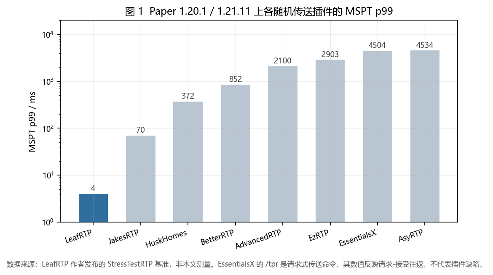
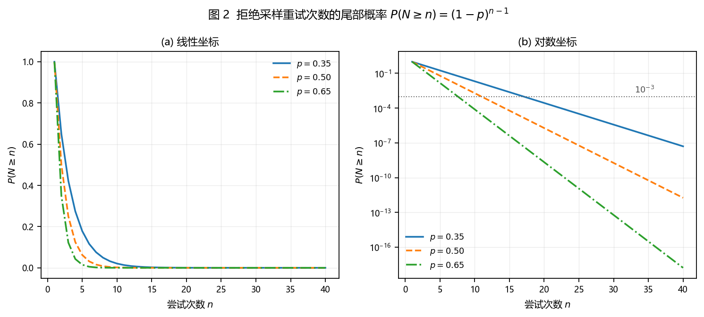
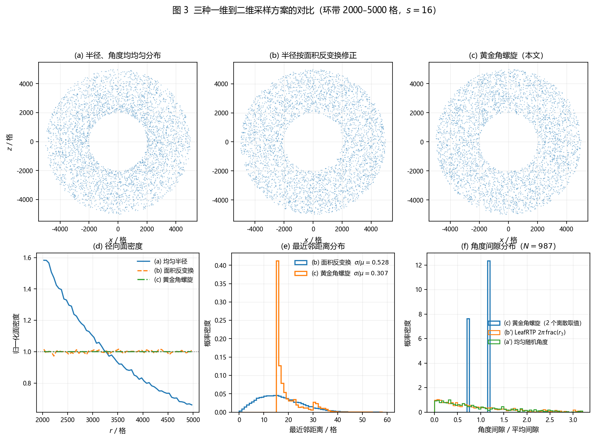
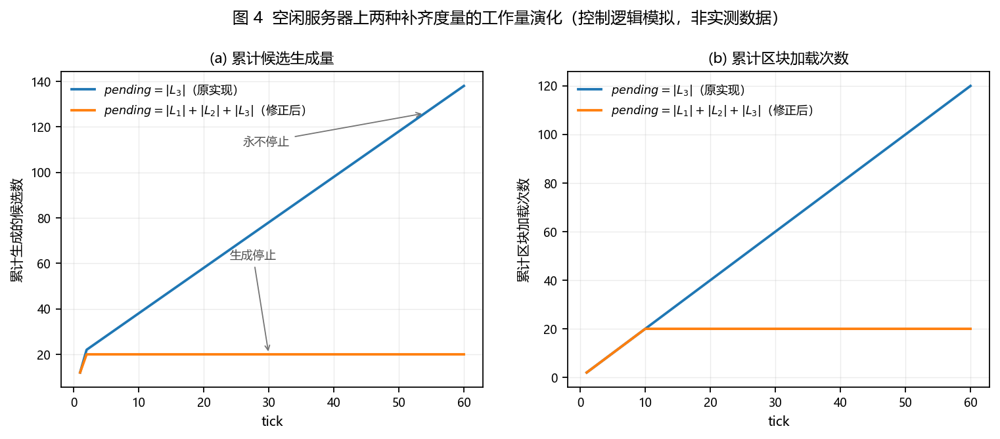
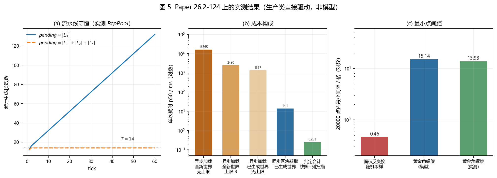

# 随机传送的确定性采样与分级预取：`/rtp` 算法设计与实现

> 项目地址：<https://gitee.com/IYeaSakura/EasyTP>　·　MIT License

EasyTP 是一个 PaperMC 传送插件，`/rtp` 负责把玩家送到一个随机且安全的位置。

这个命令的功能定义只有一句话，但它在服务器上的实际表现对实现方案高度敏感。LeafRTP 项目发布的基准测试[1]显示，在相同的测试框架、世界与客户端配置下，不同随机传送插件的主线程 MSPT 第 99 百分位从 $4\ \mathrm{ms}$ 跨越至 $4534\ \mathrm{ms}$，相差约 1134 倍；而除 EssentialsX 之外（其 `/tpr` 为请求式命令，数值反映请求—接受往返），其余七个插件的吞吐量落在 $1.7$–$20$ 次/秒，跨度约 12 倍。即**吞吐量差一个数量级，卡顿差三个数量级**。这说明性能差异的来源不是吞吐设计，而是单次搜索代价的分布形态。



**图 1** Paper 1.20.1 / 1.21.11 上各随机传送插件的 MSPT p99（数据引自参考资料 [1]，非本文测量）

本文的分析起点是一个实际观测到的现象：早期版本的 `/rtp` 在多数情况下响应正常，但存在长尾——部分调用持续较长时间后返回失败。该现象的结构性成因可以在不依赖服务端的条件下由模型与数值实验复现，本文即按此顺序展开：先建立朴素方案的模型并定位其失效模式，再给出替代设计，最后汇总上界并说明未验证的部分。

文中模型的数值与图上标注同源；第 10 节的实测数据由基准插件在真实服务端上采集，环境与测量中的陷阱见文末附录。

---

## 一、随机取点加重试为什么不可靠

### 1.1 方案的形态

早期实现由取点与判定两阶段构成，两者被合并在同一重试循环内。下列代码是该结构的**示意性重构**，用于说明控制流，并非当时的源码原文：

```java
Location randomLocation(World world, int minRadius, int maxRadius) {
    double angle = ThreadLocalRandom.current().nextDouble() * 2 * Math.PI;
    double radius = minRadius + ThreadLocalRandom.current().nextDouble() * (maxRadius - minRadius);
    int x = (int) (radius * Math.cos(angle));
    int z = (int) (radius * Math.sin(angle));
    return new Location(world, x, 64, z);
}

Location findSafe(World world) {
    for (int attempt = 0; attempt < MAX_ATTEMPTS; attempt++) {
        Location candidate = randomLocation(world, 2000, 5000);
        Location safe = searchColumn(candidate);   // 区块加载 + 列扫描
        if (safe != null) return safe;
    }
    return null;   // 失败
}
```

其中 `searchColumn` 需要加载候选点所在区块，并自世界顶部向下扫描以确定可站立的位置。该循环把三项彼此独立的职责——选点、判定与记忆——压缩在同一控制流内，后文四类失效模式均可追溯至这一耦合。

### 1.2 采样偏差

取点方式本身就不是面积均匀的。设环带内外半径分别为 $r_1$、$r_2$，令半径与角度在各自区间上均匀取值，则半径落入 $[r, r+\mathrm{d}r]$ 的概率为 $\mathrm{d}r/(r_2-r_1)$，而该环带的面积为 $2\pi r\,\mathrm{d}r$。故面密度

$$
\rho_{\text{naive}}(r) \;\propto\; \frac{1}{2\pi r \cdot (r_2 - r_1)} \;\propto\; \frac{1}{r}
\tag{1}
$$

随半径增大而单调衰减：采样点向圆心聚集，外圈利用率不足。数值结果见图 3(d)：归一化面密度自内缘的 $1.583$ 降到外缘的 $0.661$。

这类偏差不会引发异常，也不降低单次接受概率，只表现为"部分区域被反复使用、部分区域从未被访问"，因而在功能测试中很难暴露。

### 1.3 单次尝试的代价不是常数

设单次尝试的代价为 $C$，单次接受概率为 $p$，则完成一次成功传送的总代价期望为

$$
\mathbb{E}\left[C_{\text{total}}\right] \;=\; \frac{\bar{C}}{p}
\tag{2}
$$

若 $\bar{C}$ 为常数，该量级可以接受：LeafRTP 的测量表明约 $35\%$–$65\%$ 的世界面积因海洋、岩浆与虚空而不适于落点[1]，取 $p = 0.5$ 时期望仅需两次尝试。

问题在于 $\bar{C}$ 不是常数。拒绝采样倾向于向远处与未探索区域投点，而这些位置的区块通常尚未生成。加载一个已在磁盘上的区块与触发一次地形生成，代价相差一个数量级以上。于是形成正反馈：$C$ 越大越容易触发下一次重试，重试又继续累积代价。式 (2) 中的 $\bar{C}$ 因而随重试次数单调上升，而非保持稳定。

### 1.4 尾部无界

重试次数 $N$ 服从参数为 $p$ 的几何分布，其尾概率为

$$
\Pr(N \ge n) \;=\; (1-p)^{n-1}
\tag{3}
$$

对 $p = 0.35$ 计算得 $\Pr(N \ge 10) \approx 2.07\%$，$\Pr(N \ge 20) \approx 2.79 \times 10^{-4}$。单次调用的长尾概率极小。但随机传送属于高频道操作，参考实现的压测工具即以每游戏刻一次调用为设计目标[1]；在该量级下，长尾事件在运行期内必然被触发。

这里有一处需要修正：$p$ 的实际取值比 LeafRTP 统计所暗示的更小。LeafRTP 给出的 $35\%$–$65\%$ 是按"海洋、岩浆、虚空"三类**地形**统计的不安全比例；本实现默认启用 `rtp.overworld-surface-only`，要求落点露天，因而还会排除洞穴、峡谷掩体与树冠之下的位置。在真实服务端上对一个 2000–5000 环带内的候选列调用生产实现 `findSafeSpotSync`，六轮合计 384 列中有 43 列返回了安全落点，即 $\hat{p} = 43/384 \approx 0.11$（二项标准误约 $\pm 0.016$；测法与限制见第 10 节）。代入式 (3) 可得表 1。

**表 1 尾部概率对接受率的敏感性**

| $p$ | $\mathbb{E}[N]$ | $\Pr(N \ge 10)$ | $\Pr(N \ge 20)$ | $n(10^{-3})$ |
|---|---|---|---|---|
| 0.50 | 2.0 | 0.20 % | $2 \times 10^{-4}$ % | 11.0 |
| 0.35 | 2.9 | 2.07 % | 0.028 % | 17.0 |
| 0.11（实测） | 8.9 | 34.3 % | 10.5 % | 59.2 |

$p = 0.11$ 时，二十次尝试仍然失败的概率是 10.5%，比按 $p = 0.35$ 估计的高出约 375 倍；要把失败率压到 $10^{-3}$ 需要约 59 次尝试。**露天约束把拒绝采样的尾部显著拉长了**，这解释了为什么"搜索很久然后失败"是一个反复出现的现象，而不是偶发。

图 2 以线性与对数坐标给出式 (3) 在三条 $p$ 曲线上的形态。对数坐标下曲线为直线，即尾部按指数律衰减而无截断——这正是问题所在：不存在一个"足够多次之后概率可以忽略"的转折点。



**图 2** 拒绝采样重试次数的尾部概率 $\Pr(N \ge n) = (1-p)^{n-1}$

由式 (3) 可解出达到给定容忍度 $\varepsilon$ 所需的尝试次数：

$$
n(\varepsilon) \;=\; 1 + \frac{\ln \varepsilon}{\ln (1-p)}
\tag{4}
$$

$p = 0.35$、$\varepsilon = 10^{-3}$ 时 $n \approx 17$。该量级与实测现象中"搜索较长时间后失败"的时间尺度相符。

### 1.5 没有记忆，只能靠重试上限兜底

式 (3) 的前提是各次尝试相互独立。该独立性在数学上成立，在工程上却是缺陷：**危险地形在空间上是成片的**。当采样点落入海洋中心时，其邻域的接受概率趋近于零，而循环不携带任何状态，无法识别并跳出这片区域。同理，已成功验证的区域也未被记录，同一位置会被反复完整验证。

为终止循环，实现必须设置上限 `MAX_ATTEMPTS`。该参数不存在合理取值：取值过小时长尾直接被判为失败，取值过大时单次调用会长时间占用主线程。换言之，**算法的终止性并非由结构保证，而是由人为截断引入的**。

### 1.6 失效模式汇总

上述现象可归为三类，见表 1。

**表 1 朴素方案的失效模式**

| 职责 | 在循环中的形态 | 应有的形态 |
|---|---|---|
| 选点 | `randomLocation(...)` | 纯内存计算，$O(1)$ 且有界 |
| 判定 | `searchColumn(...)`，内含区块加载 | I/O 密集操作，可异步、可预取 |
| 记忆 | 不存在 | 可持久化状态，跨调用与跨重启有效 |

三者的耦合使任一职责都无法单独优化：采样质量无法单独评估，判定成本无法单独控制，记忆无处安放。需要注意的是，"随机"这一属性只属于第一项职责，后两项都是确定性工程问题。

---

## 二、参考实现给出的四条原则

### 2.1 FastRTP：先摆正执行模型

FastRTP 有两个较为广泛使用的实现。WinSMP 版本自我描述为 "Simple and insanely fast **async** /rtp plugin. Fast on any kind of server, from lowest-end to high-end"[2]，Wesley1808 版本描述为 "A fast random teleport command that **doesn't cause lagspikes**"[3]。

两者的表述都针对执行表现而非采样质量，即其设计重心在于**判定成本所处的线程**：将整条候选搜索链异步化，使主线程不承担区块加载。这一选择同时决定三件事——请求路径的延迟、MSPT 的稳定性，以及算法能否改造为可预取形式。

### 2.2 LeafRTP：把选点变成有界的内存计算

LeafRTP 将选点从"生成随机数"改为"在空间填充曲线上查询索引"[4]：

```java
// LeafRTP 的映射方式，摘自其设计文档
d = random(0, area)
r3 = sqrt(d / pi + centerRad^2)
angle = 2 * pi * (r3 - int(r3))
```

其中 $area = \pi(r_2-r_1)(r_2+r_1)$ 为环带面积，半径由

$$
\pi\left(r_3^2 - r_{\text{center}}^2\right) = d
\tag{5}
$$

确定，即对面积作反变换。这与本文第 3.1 节采用的映射在数学上一致（令 $d = i s^2$ 即得）。两个独立实现在半径映射上收敛到同一形式，说明该式就是环带面积均匀采样的正确解。

该设计的另一半是持久化的空间记忆：把先前选点的结论连同失效原因按段存储，使选点阶段退化为"常数时间查找 + 偶发表重建"，已知无效的位置直接跳过。这正是第 1.5 节无记忆性问题的直接对策。

此外，LeafRTP 引入 Anvil 预过滤，直接读取 `.mca` 区域文件中的生物群系与方块数据，在任何区块被加载之前完成整批候选的筛选。其文档指出，`getBiome`、`getHighestBlockAt` 这类便捷方法依据地形生成噪声图作答，世界被编辑或跨版本迁移后噪声图可能与真实地形不一致[1]。这给出一条可迁移的判断准则：**判定的价值取决于执行时机的早晚，而非精度。**

### 2.3 四条原则

**表 2 参考实现归纳出的设计原则**

| 原则 | 对应的失效模式 |
|---|---|
| 选点为 $O(1)$ 内存计算 | 式 (1) 的采样偏差；式 (2) 中 $\bar{C}$ 的非平稳性 |
| 判定结果可持久化复用 | 第 1.5 节的无记忆性 |
| 判定与选点解耦、可提前执行 | 式 (3) 的尾部无界；`MAX_ATTEMPTS` 的困境 |
| 并发与队列有明确上界 | 长尾放大；命令可被滥用为压测工具 |

另有一项反向经验值得记录。LeafRTP 作者验证了"优先使用已加载区块"这一看似显然的优化，结论是它会把玩家成批送入彼此的基地，从而加剧破坏或引发继续重试（取决于是否接入领地插件）[1]。这说明采样策略的优化不能只以成本指标衡量——落点分布本身构成产品行为的一部分。

---

## 三、确定性螺旋采样

### 3.1 环形分区与面积守恒映射

世界被划分为若干带权重的环形区域（ring zone）：

```java
public record RingZone(
        @NotNull String name,
        int minRadius,
        int maxRadius,
        double weight,
        double cumulativeWeight
) {
    public long area() {
        return (long) Math.PI * ((long) maxRadius * maxRadius - (long) minRadius * minRadius);
    }

    public long estimatedPoints(int gridSpacing) {
        long spacingSq = (long) gridSpacing * gridSpacing;
        if (spacingSq <= 0) {
            return 1;
        }
        return Math.max(1, area() / spacingSq);
    }
}
```

默认配置见表 3。

**表 3 环形分区默认配置**

| 环 | 半径范围 | 权重 |
|---|---|---|
| `near` | 2000 – 3500 | 20 |
| `mid` | 3500 – 5000 | 60 |
| `far` | 5000 – 7500 | 20 |

权重只决定选环概率，与环带面积无关。表 3 中三个环带的面积并不相等（`mid` 最大），因此权重相等并不意味着面积意义上的点密度相等；若目标为全图面积均匀，应按环带面积反比配置权重。

每个环带维护独立的一维索引。给定索引 $i$：

```java
double cumulativeArea = index * (double) gridSpacing * (double) gridSpacing;
double radius = Math.sqrt((double) ring.minRadius() * ring.minRadius() + cumulativeArea / Math.PI);
radius = Math.min(radius, ring.maxRadius());
```

整理即得

$$
\pi\left(r_i^2 - r_{\min}^2\right) = i\,s^2
\qquad\Longleftrightarrow\qquad
r_i = \sqrt{r_{\min}^2 + \frac{i\,s^2}{\pi}}
\tag{6}
$$

式 (6) 左端是内半径 $r_{\min}$、外半径 $r_i$ 所夹环带的面积。也就是说，**索引每增加 1，覆盖的面积恰好增加 $s^2$**。取 $s = 16$ 时每个索引对应 256 平方格；该值在构造时被限制为 $s \ge 4$。

由此可得面密度。半径区间 $[r, r+\mathrm{d}r]$ 内的索引数由式 (6) 微分得到

$$
\mathrm{d}i = \frac{2\pi r}{s^2}\,\mathrm{d}r
\tag{7}
$$

而该环带面积为 $2\pi r\,\mathrm{d}r$，故

$$
\rho(r) = \frac{\mathrm{d}i}{2\pi r\,\mathrm{d}r} = \frac{1}{s^2} = \text{const}
\tag{8}
$$

面密度与 $r$ 无关，式 (1) 的向心聚集被完全消除。这是解析结果，不依赖统计量。图 3(d) 给出数值验证：螺旋方案的归一化面密度在全部 60 个径向分箱上恒为 $1.000$，而均匀半径方案为 $1.583 \to 0.661$；面积反变换方案的极差为 $[0.972,\ 1.017]$，其偏离完全来自有限样本的涨落。

令 $r_i = r_{\max}$，得环带容量

$$
N_{\text{ring}} = \left\lfloor \frac{\pi\left(r_{\max}^2 - r_{\min}^2\right)}{s^2} \right\rfloor
\tag{9}
$$

对默认的 2000–5000 环带与 $s = 16$，$N_{\text{ring}} = 257708$。式 (9) 与 `RingZone.estimatedPoints` 的实现完全一致——两者不是各自近似，而是同一关系的两种写法。

### 3.2 角度映射与三间隙定理

半径确定后还需把索引映射到角度。本文采用黄金角：

$$
\alpha = \pi\left(3 - \sqrt{5}\right) \approx 2.39996\ \mathrm{rad} \approx 137.5^\circ,
\qquad
\theta_i = i\alpha \bmod 2\pi
\tag{10}
$$

**这是本文与 LeafRTP 在采样映射上的唯一分歧**：后者以半径的小数部分导出角度（$2\pi(r_3 - \lfloor r_3\rfloor)$），本文以索引导出。两者都是"一维索引 → 二维坐标"的空间填充映射，差别只在角度的生成方式。

采用式 (10) 的动因不是"渐近均匀分布"这类粗略性质，而是三间隙定理（three-gap theorem）给出的更强结构：序列 $\{i\alpha \bmod 2\pi\}_{i=0}^{N-1}$ 排序后，相邻元素之间的间隙至多取三个不同值，且最大者等于其余两者之和。当 $N$ 为 Fibonacci 数时恰取两个值。

这意味着**间隙存在正下界，不存在两个任意接近的采样点**。数值验证见图 3(f)：取 $N = 987$（Fibonacci 数）时，理想角度序列的间隙只取 $0.7236$ 与 $1.1708$ 两个值，二者之比为 $1.618$，即黄金比。

图 3(f) 中同时给出了 LeafRTP 的角度映射（$\theta = 2\pi\,\mathrm{frac}(r_3)$，$d \sim U(0, \mathrm{area})$）作为对照，因为这才是真正需要比较的替代方案。结果很明确：由于 $d$ 每次独立抽取，且对均匀的 $d$ 而言 $\mathrm{frac}(r_3)$ 的密度 $\propto \sum_k (u+k)$ 在 $u$ 上几乎是常数，其角度间隙的分布与均匀随机角度**统计上无法区分**——两者的 $P(\text{间隙} < 0.2)$ 分别为 $17.93\%$ 与 $17.83\%$，最小间隙分别为 $0.0000$ 与 $0.0009$。而黄金角方案的最小间隙是 $0.7236$，且只取两个离散值。

因此在这一个统计量上，黄金角方案**同时优于**均匀随机角度与 LeafRTP 的映射。这里必须说明该结论的边界：它刻画的是采样点集在角向的规则性，**不等于**整体方案更优。LeafRTP 的段式空间记忆会在另一条路径上消除冗余验证，两种设计并不互斥。

还有一处实现层面的限制需要指出，否则上面的结论会被错误地外推。整数坐标取整会给每个点的角度带来约 $0.5/r$ 的扰动（$r = 2000$ 时约 $2.5 \times 10^{-4}\ \mathrm{rad}$），而 $N$ 个点的平均角度间隙是 $2\pi/N$。两者之比随 $N$ 增长：

| $N$ | 平均间隙 / rad | 扰动 / 间隙 | 最小间隙 / 均值 |
|---|---|---|---|
| 987 | $6.37 \times 10^{-3}$ | 0.03 | 0.656 |
| 5 000 | $1.26 \times 10^{-3}$ | 0.16 | 0.152 |
| 20 000 | $3.14 \times 10^{-4}$ | 0.64 | 0.000 |
| 200 000 | $3.14 \times 10^{-5}$ | 6.37 | 0.000 |

也就是说，**当 $N$ 超过约两万、平均间隙小于取整扰动时，角向的三间隙结构在坐标层面不再可观测**。上表由第 10 节实测数据统计得到。

这一限制不影响设计意图，因为要保证的其实不是角向间隙，而是**二维点间距有下界**。整数网格本身把下界钉在 1 格，而实测结果远好于此：20000 个点内的最小点间距为 $13.93$ 格（同规模、同环带的面积反变换随机采样为 $0.46$ 格），相差约 30 倍。图 5(c) 给出该对照。

最后澄清一个常见误述：向日葵螺旋**并不**构成严格意义上的低差异序列。其差异度上界为 $O(N^{-1/2})$，与随机采样同阶，只是常数更小。本文的数值实验支持这一判断——面元计数离散度 $\sigma/\mu$ 在螺旋方案下为 $0.151$，在面积反变换的随机方案下为 $0.164$，两者接近；而最近邻距离的离散度分别为 $0.307$ 与 $0.528$（图 3(e)），差异显著。可见螺旋方案的真正优势在于**局部间距的规则性**，而非全局差异度。面积反变换方案最近邻离散度 $0.528$ 与二维 Poisson 过程的理论值 $\sqrt{4/\pi - 1} = 0.523$ 吻合，可作为该统计量实现正确性的旁证。

### 3.3 索引持久化、取模与越界

索引按「世界 + 环名」持久化，使服务器重启后螺旋继续推进，而非重复覆盖已使用区域。写入前取模：

```java
long maxPoints = ring.estimatedPoints(gridSpacing);
if (maxPoints > 0) {
    index = index % maxPoints;
}
```

取模有两个作用：防止索引在长期运行下溢出；把螺旋限制在环带容量内——超过 $N_{\text{ring}}$ 的点半径已被 $\min(\cdot, r_{\max})$ 截断，继续递增只是重复外圈圆周。

代价是**序列的周期性**：走完一周后序列从头开始，若空间记忆未能阻止重复提交，同一批坐标会被重新生成。这一点见第 4.5 节与第十二节。

世界边界是矩形而环带是圆形，二者不重合，越界点须排除。实现上没有用重采样循环：

```java
int safety = 0;
while (safety < 16) {
    Coordinate candidate = mapIndex(ring, index);
    if (isInsideBorder(world, candidate)) {
        return candidate;
    }
    safety++;
    index = (index + 1) % Math.max(1, maxPoints);
}
return mapIndex(ring, index);
```

推进预算固定为 16，用尽后返回当前点，由调用方在入队前复判边界并丢弃。

越界处理有一个语义陷阱：**越界不能作为一种判定结果被持久化**。世界边界可以被管理员修改，当前不可达的坐标未来可能变为可达。若把"越界"当作不安全状态写进空间记忆，边界扩大后该单元会被永久跳过，且不存在纠正机制。实现上采取三项措施：越界不落库；边界检查前移到空间记忆查询**之前**，使越界点不触发数据库访问；启动时执行一次清理：

```sql
DELETE FROM easytp_rtp_spatial_memory WHERE state = 'unsafe_border'
```

另外，局部推进与重采样在分布上并不等价：越界段之后的第一个有效点沿螺旋紧邻，而非独立重抽。这会在边界附近引入轻微的空间相关性，属于已知近似。



**图 3** 三种一维到二维采样方案的对比（环带 2000–5000 格，$s = 16$）

---

## 四、空间记忆：把重试换成跳过

### 4.1 状态空间

判定结果用枚举表示，而不是布尔值，见表 4。

**表 4 空间记忆状态**

| 状态 | 含义 |
|---|---|
| `UNKNOWN` | 尚无判定 |
| `SAFE` | 可用于落点 |
| `UNSAFE_BLOCK` | 方块条件不满足 |
| `UNSAFE_BIOME` | 生物群系在黑名单中 |
| `UNSAFE_VOID` | 该列无实体方块 |
| `UNSAFE_CLAIM` | 领地占用（枚举已预留，无代码产生） |
| `UNSAFE_BORDER` | 越界（旧版本状态，不再写入） |

区分失效原因而非合并为单一 `UNSAFE`，主要服务于诊断：汇总中可以分别观察各失效原因的占比，据此判断该调整黑名单还是该放宽落点条件。

### 4.2 单元聚合

判定结果不按方块存储，而按固定边长的单元聚合：

```java
private int cell(int blockCoord) {
    return Math.floorDiv(blockCoord, cellSize);
}
```

此处必须用 `Math.floorDiv` 而非整除运算符。Java 的整除向零截断，所以 `-15 / 16` 与 `0 / 16` 都得 $0$：单元 $0$ 覆盖 $[-15,\ 15]$，共 31 格；而单元 $-1$ 覆盖 $[-31,\ -16]$，只有 16 格。格网因此不是"单元重叠"，而是**在原点单侧被加宽**——单元宽度不再一致，跨零点的方块会被归进一个过宽的单元。实测各单元宽度为 $\{2,\ 16,\ 31\}$，而 `Math.floorDiv` 向下取整后恒为 16。

聚合引入了精度损失：单元内任一位置不安全即视为整单元不安全（反之亦然）。单元边长默认为 $c = 32$ 格，这个粒度足以避免相邻区域的重复分析，同时把状态条目数降低约 $c^2 = 1024$ 倍。

### 4.3 查询顺序

查询按"内存缓存 → 未落盘缓冲 → 数据库"三级进行：

```java
String key = cacheKey(world, cellX, cellZ);
RegionState cached = cache.get(key);
if (cached != null) {
    hits.increment();
    return cached;
}
misses.increment();

RegionState pending = storage.peekPendingRegionState(world, cellX, cellZ);
if (pending != null) {
    cache.putIfAbsent(key, pending);
    return pending;
}

RegionState loaded = storage.loadRegionState(world, cellX, cellZ);
if (loaded != RegionState.UNKNOWN) {
    cache.putIfAbsent(key, loaded);
}
return loaded;
```

中间层级的必要性来自第 8 节的写回式持久化：某单元可能已被判定但尚未落盘，跳过该层直接查库会读到过期值。这不是理论边界——内存缓存有容量上限，单元被淘汰后再次查询必然走完整路径，因此"缓存淘汰 + 写回延迟"会让读回过期状态成为常态。

两处回填都用 `putIfAbsent` 而非 `put`，因为查询过程中可能有其他线程写入更新的状态，回填不能覆盖它。

`UNKNOWN` 结果不写缓存。缓存的职责是保存结论，而"未知"不构成结论；缓存它只会让后续查询持续命中没有信息量的条目，并挤占有效容量。数据库读取失败与"未找到记录"在实现上无法区分，二者都返回 `UNKNOWN`，因此缓存该值会把一次瞬时故障变成该单元的长期误判。

数据库访问位于缓存锁之外。这不会引入正确性问题（回填使用 `putIfAbsent`），但能保证单次慢查询不阻塞其他单元的读取。

### 4.4 有界缓存

内存缓存采用访问序（access-order）LRU：

```java
this.cache = Collections.synchronizedMap(new LinkedHashMap<>(16, 0.75f, true) {
    @Override
    protected boolean removeEldestEntry(@NotNull Map.Entry<String, RegionState> eldest) {
        return size() > capacity;
    }
});
```

容量由 `rtp.spatial-memory.max-entries` 控制，默认 50000。

访问序模式下 `get` 会修改内部链表以维护访问顺序，因此**读操作也必须持锁**。这与普通 `HashMap` 的并发语义不同，也是外层必须包 `Collections.synchronizedMap` 的原因：无锁并发读会破坏链表结构，而不是仅仅读到旧值。

命中率与未命中率分别计数，其比值是判断容量是否合理的直接依据。未命中率显著偏高意味着容量过小，LRU 正在反复淘汰与重载同一批单元。

### 4.5 记忆的语义边界

需要明确空间记忆的语义边界：它**排除已知不可用的区域**，但**不去重已知可用的区域**。候选入队的条件是

```java
RegionState state = spatialMemory.getState(world, coordinate.x(), coordinate.z());
if (state == RegionState.UNKNOWN || state == RegionState.SAFE) {
    pool.offerCandidate(new RtpCandidate(world.getName(), coordinate.x(), coordinate.z()));
    statGenerated.increment();
} else {
    statRejectedMemory.increment();
}
```

`SAFE` 与 `UNKNOWN` 一并入队。该选择简化了逻辑，但带来可量化的开销：单元边长 $c = 32$、网格间距 $s = 16$ 时，单元面积为 $c^2 = 1024$ 平方格，按式 (8) 计算其中约含 $c^2/s^2 = 4$ 个采样点。这些点会各自进入流水线，各自触发一次区块加载请求与一次完整的列扫描，最终得出相同结论。第二次访问时区块通常已在内存中，成本低于首次，但列扫描与状态写入仍然发生。

这是一处已知但未实施的优化点：在流水线内维护按单元索引的"近期已提交"集合，对同一单元在时间窗口内去重。

它对第 6.3 节的守恒式有一处影响需要说明。式 (13) 对**条目**成立，但对**已覆盖的不同区域**不成立：同一单元的 4 个采样点会各自产生一个已验证条目，条目计数正常增长，而实际覆盖的区域并未增加。也就是说，去重缺失使流水线内部包含了一种**隐性重试**——产出被计入，但其中一部分是重复的。式 (13) 本身不受影响（它约束的是条目数），受影响的是一张池容量表所对应的真实区域覆盖率。

---

## 五、落点判定

判定在 `ChunkSnapshot` 上执行。快照是与服务器线程解耦的只读副本，可以在异步线程中安全地做大量方块查询——这是"判定与选点解耦"得以成立的技术前提。

### 5.1 地表扫描与三格模型

```java
private int findSurfaceY(@NotNull ChunkSnapshot snapshot, int localX, int localZ, @NotNull World world) {
    for (int y = world.getMaxHeight() - 1; y >= world.getMinHeight(); y--) {
        if (!snapshot.getBlockType(localX, y, localZ).isAir()) {
            return y;
        }
    }
    return world.getMinHeight();
}
```

该值随后用于限定搜索下界并判断候选点是否露天。主世界判定以三格为单位逐层下移：

```java
for (int y = surfaceY; y >= minY; y--) {
    Material floor = snapshot.getBlockType(localX, y - 1, localZ);
    Material foot = snapshot.getBlockType(localX, y, localZ);
    Material head = snapshot.getBlockType(localX, y + 1, localZ);

    if (floor == Material.BEDROCK || isLiquidSurface(foot)) {
        continue;
    }
    if (!isSafeFloor(floor) || !isPassable(foot) || !isPassable(head)) {
        continue;
    }

    Location candidate = new Location(world, x + 0.5, y, z + 0.5);
    if (surfaceY < y + 1) {
        return candidate;
    }
    if (fallbackSpot == null) {
        fallbackSpot = candidate;
    }
}
```

三格对应玩家实体的碰撞箱：$y-1$ 是承重方块，$y$ 与 $y+1$ 是玩家占据的两格空间。三者的判定条件并不对称：脚下方块要求 `isSolid()` 且不在不安全集合中，而脚部与头部空间只要求不阻挡通行：

```java
private boolean isPassable(@NotNull Material type) {
    if (type.isAir()
            || type == Material.VINE
            || type == Material.TALL_GRASS
            || type == Material.SHORT_GRASS
            || type == Material.SNOW) {
        return true;
    }
    if (!params.allowLiquid() && (type == Material.WATER || type == Material.LAVA)) {
        return false;
    }
    return !type.isSolid();
}
```

草、藤蔓与雪必须显式列入白名单。仅用 `isSolid()` 判定会把它们视为阻挡，导致玩家落在草地或雪原上时被误判为"空间不足"。

### 5.2 露天优先与掩体回退

搜索并不返回第一个满足条件的层，而是区分两类结果：

```java
if (surfaceY < y + 1) {
    return candidate;
}
if (fallbackSpot == null) {
    fallbackSpot = candidate;
}
```

若 $y + 1 > \text{surfaceY}$，则玩家头部以上没有方块，即处于露天位置，立即返回；否则该位置在洞穴或建筑内部，仅记为候选并继续下移。循环结束后，若 `params.surfaceOnly()` 为真则返回 `null`，否则返回第一个掩体候选。优先级为：**最浅的露天位置 > 最浅的掩体位置 > 不合格**。该参数对应配置项 `rtp.overworld-surface-only`，默认开启。

搜索下界由 `maxScanDepth` 限定：

```java
int minY = Math.max(world.getMinHeight() + 1, surfaceY - params.maxScanDepth());
```

由此得到最坏情况下的确定上界。当 $\text{minY} = \text{surfaceY} - d$（$d$ 为 `maxScanDepth`）时，循环迭代 $d+1$ 次，每次执行 3 次方块查询，故单列的方块查询次数不超过

$$
Q_{\text{col}} \le 3(d+1)
\tag{11}
$$

$d = 16$ 时为 51 次，与地形复杂度无关。（`findSurfaceY` 自世界顶部向下扫描，迭代次数另计，上界为世界高度。）

### 5.3 维度差异化

下界自固定高度向下搜索，且把岩浆视为不可站立：

```java
int startY = Math.min(world.getMaxHeight() - 5, 120);

for (int y = startY; y >= world.getMinHeight() + 1; y--) {
    Material floor = snapshot.getBlockType(localX, y - 1, localZ);
    Material foot = snapshot.getBlockType(localX, y, localZ);
    Material head = snapshot.getBlockType(localX, y + 1, localZ);

    if (floor == Material.BEDROCK || floor == Material.LAVA) {
        continue;
    }
    if (isLiquidSurface(foot) || isLiquidSurface(head)) {
        continue;
    }
    if (isSafeFloor(floor) && isPassable(foot) && isPassable(head)) {
        return new Location(world, x + 0.5, y, z + 0.5);
    }
}
```

起始高度取 $\min(y_{\max} - 5,\ 120)$ 而非世界顶部，是因为下界在 $y > 120$ 以上基本为空或为基岩顶盖，自顶部扫描只会产生无效迭代。下界整体位于封闭维度内，没有"露天"概念，因此不需要掩体回退。

末地起始高度取 $\min(y_{\max} - 5,\ 80)$，不排除岩浆（末地无自然岩浆），但排除虚空：找不到任何承重方块时返回 `null`。主岛之外全是虚空，这是三个维度中最需要严格排除落点的情况。

生物群系黑名单仅对主世界生效：

```java
private boolean isBlacklistedBiome(@NotNull ChunkSnapshot snapshot, int x, int z, @NotNull World world) {
    if (biomeBlacklist.isEmpty() || world.getEnvironment() != World.Environment.NORMAL) {
        return false;
    }
    int localX = x & 0xF;
    int localZ = z & 0xF;
    Biome biome = snapshot.getBiome(localX, world.getSeaLevel(), localZ);
    return biomeBlacklist.contains(biome.getKey());
}
```

群系在 `seaLevel` 高度采样，而不是候选点高度。原因是候选高度此时还不知道，而黑名单必须在列扫描之前作为快速拒绝条件使用，才能避免对海洋、深暗之域这类目标群系执行完整列扫描。这一步与 LeafRTP 的 Anvil 预过滤是同一个思路：能在昂贵操作之前完成的筛选，不要推迟到之后。

---

## 六、分级预取与流水线守恒

前五节描述的是单点判定。要让玩家敲下 `/rtp` 立刻拿到结果，判定必须提前完成并缓存起来——这正是朴素方案缺失的一环。

### 6.1 三级池

**表 5 三级预取池**

| 层级 | 内容 | 取用成本 |
|---|---|---|
| $L_1$ 热池 | 已验证，区块处于加载状态 | 直接可用 |
| $L_2$ 冷池 | 已验证，区块需重新加载 | 一次异步区块加载 |
| $L_3$ 候选队列 | 仅有坐标，未验证 | 一次加载 + 一次列扫描 |

三者均为 `ConcurrentLinkedQueue`。验证完成后按区块是否处于加载状态归档：

```java
public void addValidated(@NotNull RtpLocation location, boolean chunkLoaded) {
    if (chunkLoaded) {
        hotPool.offer(location);
    } else {
        coldPool.offer(location);
    }
}
```

分层而非单一队列的依据是两类条目的取用代价差异显著：$L_1$ 命中时玩家感知不到等待，$L_2$ 命中需要等待数十至数百毫秒的区块加载。分离存储使取用逻辑可以严格优先 $L_1$，同时让两类条目数成为可观测指标。

这里与 LeafRTP 有一处取舍差异：后者将选中区块**强制保持加载**直至被使用，依据是"$10$–$100$ 个额外区块的成本低于一个在线玩家"[4]，以此换取毫秒级响应。本文没有采用强制加载，而是按"区块是否已加载"分区存放。两者的差别在于用常驻内存换响应速度，还是用一次加载换更低的常驻开销，属资源分配决策，不是算法正确性问题。

### 6.2 目标容量与空闲门禁

池的目标容量随在线人数线性增长：

```java
public int targetSize(int onlinePlayers) {
    return baseSize + (int) Math.round(onlinePlayers * sizeMultiplier);
}
```

即

$$
T(n) = B + \left\lfloor \mu n \right\rceil
\tag{12}
$$

默认 $B = 12$、$\mu = 2.0$：无人在线时 $T = 12$，10 人在线时 $T = 32$。

在线人数为零时，两个后台 tick 直接返回：

```java
int online = Bukkit.getOnlinePlayers().size();
if (online <= 0) {
    statIdleSkips.increment();
    return;
}
```

没有消费者时生成的位置不会被取用，而每次生成都意味着一次区块加载，通常还伴随地形生成。

### 6.3 流水线守恒

补齐逻辑是整条流水线里最容易出错的地方。原实现按候选队列长度判断是否需要补充：

```java
int needed = target - pool.candidateSize();
```

该式看似合理，实际违反流水线守恒。候选点经验证后**离开** $L_3$ 并**进入** $L_1/L_2$，队列因此重新变空，下一 tick 再度判定需要补充。**已完成的产出没有被计入"待产出"总量**，后果是生成—校验循环永不停止：`trimToTarget` 把已验证池压回 $T$ 时丢弃的位置，立即被重新生成。若进一步移除 `trimToTarget`，问题会退化为已验证池的无界增长。

正确形式必须统计流水线持有的全部位置：

```java
int pending = pool.validatedSize() + pool.candidateSize();
int needed = target - pending;
if (needed > 0) {
    int toGenerate = Math.min(needed, params.poolBaseSize());
    refillWorld(world, toGenerate);
}
pool.trimToTarget(online);
```

即

$$
\text{needed} = T - \left(|L_1| + |L_2| + |L_3|\right)
\tag{13}
$$

其中 `validatedSize()` 为 $|L_1| + |L_2|$。已验证池填满后 $\text{needed} \le 0$，生成自动停止，直到一次传送消费掉某个位置才恢复。预取由此成为需求驱动的稳态过程，而不是速率固定的生成器。

图 4 在空闲服务器场景下对两种度量作了数值模拟：设 $T = 20$、$B = 12$、每 tick 校验 2 个候选、无玩家消费，并施加 `trimToTarget`。原实现的两条曲线在 60 个 tick 内线性增长，累计候选生成量 138、累计区块加载次数 120；修正后这两项分别在 tick 2 与 tick 10 停止增长，60 个 tick 内的累计量均为 20。

第 10 节在真实服务端上用生产类 `RtpPool` 复现了这一对照。有一点必须与生产一致：补齐目标与收缩目标来自同一次调用 `pool.targetSize(online)`，一人在线时为 $12 + 2 \times 1 = 14$。只有两者取同一个值，对照才反映真实行为。结果如下：

| 补齐度量 | 60 tick 累计生成 | 60 tick 累计校验 | 结束时候选队列 | 结束时已验证池 |
|---|---|---|---|---|
| $pending = \lvert L_3 \rvert$（原实现） | 132 | 120 | 12 | 14 |
| $pending = \lvert L_1 \rvert + \lvert L_2 \rvert + \lvert L_3 \rvert$ | 14 | 14 | 0 | 14 |

修正后的曲线在 tick 2 停止生成、tick 7 停止校验，此后完全静止；原实现则以每 tick 2 次的速度持续生成与校验，60 个 tick 内做了 120 次区块加载，而净产出始终为零。**空闲服务器上原实现浪费的区块加载量由校验速率决定，与目标容量无关**——把 `base-size` 调小并不能缓解它。实测曲线见图 5(a)。



**图 4** 空闲服务器上两种补齐度量的工作量演化（控制逻辑模拟，非实测数据）

收缩逻辑优先丢弃冷池条目：

```java
public void trimToTarget(int onlinePlayers) {
    int target = targetSize(onlinePlayers);
    int over = validatedSize() - target;
    while (over-- > 0) {
        RtpLocation dropped = coldPool.poll();
        if (dropped == null) {
            dropped = hotPool.poll();
        }
        if (dropped == null) {
            break;
        }
    }
}
```

玩家的请求会临时推高目标容量，处理完毕后需要收缩。优先丢弃 $L_2$ 的依据是 $L_1$ 条目对应的区块已经加载，丢弃它们不会立即节省资源，反而浪费了已支付的加载成本。

### 6.4 取用顺序与陈旧回退

请求按 $L_1 \to L_2 \to L_3$ 取用。$L_1$ 命中直接返回；$L_2$ 命中必须先复核：

```java
RtpLocation cold = pool.pollCold();
if (cold != null) {
    loadAndDeliver(player, cold, onSuccess, () -> {
        statStaleFallbacks.increment();
        enqueueForFreshLocation(player, world, pool, onSuccess, onFailure);
    });
    return;
}
```

复核不能省略，LeafRTP 也保留了这一步[4]。池中位置可能驻留较长时间，期间区块被卸载、地形被玩家修改或被其他插件改动。复核失败不产生面向玩家的错误，而是静默回退到现场生成路径并计数。该设计使池命中率下降只表现为延迟上升，不表现为失败。

### 6.5 排队与惰性过期

三级池都无法立即满足时，玩家进入等待队列，并在全局调度器上设置超时：

```java
scheduler.runLaterGlobal(() -> {
    if (pendingCallbacks.remove(player.getUniqueId()) != null) {
        pool.removePlayer(player.getUniqueId());
        statWaitTimeouts.increment();
        onFailure.run();
    }
}, Math.max(20L, params.playerWaitTimeoutSeconds() * 20L));
```

队列自身也维护过期判定，但采用惰性策略，在取出时检查入队时间：

```java
public QueuedPlayer pollWaitingPlayer() {
    long now = System.currentTimeMillis();
    QueuedPlayer queued;
    while ((queued = waitingPlayers.poll()) != null) {
        if (now - queued.enqueueTime() <= playerWaitTimeoutMillis) {
            return queued;
        }
    }
    return null;
}
```

过期因此有两条独立路径：引擎侧的定时回调负责向玩家报告失败，队列侧在取出时丢弃过期条目。二者不会互相干扰——回调通过 `pendingCallbacks.remove` 的返回值保证只触发一次。交付失败时玩家被重新入队而不是丢弃：

```java
pendingCallbacks.put(queued.playerId(), callback);
pool.requeuePlayer(queued);
```

该分支覆盖"位置恰在轮到该玩家之前被其他玩家取走"的竞态。

队列另有一项副作用值得指出。LeafRTP 作者把队列视为**防止 `/rtp` 被用作压测工具**的手段：限制队列长度与产出速率，即限制了外部通过命令可触发的区块加载总量[4]。本文采用同一思路。

---

## 七、背压控制

### 7.1 速率不等于并发

配置项 `rtp.pool.max-validations-per-tick` 与 `rtp.pool.max-chunk-loads-per-tick` 限定的是**每 tick 提交的验证请求数**。但验证是异步的：`validateCandidate` 提交完区块加载请求就返回，不等待结果。因此二者实际控制的是提交速率而非并发度。

当区块系统因地形生成而降速时，提交速率不变而完成速率下降，待处理队列随之无界增长，此时速率限制不具备约束力。这是第 1.4 节"尾部无界"在异步化之后的新形态：**同步实现的问题是延迟不可控，异步实现的问题是队列不可控。** 更换执行模型并不能自动消除它。

真正的约束来自并发上限。设在途请求数为 $A$、上限为 $M$，则每 tick 的可用预算为

$$
B = \max\left(0,\; M - A\right)
\tag{14}
$$

```java
int budget = params.maxInFlightLoads() - inFlightLoads.get();
if (budget <= 0) {
    statBackpressureSkips.increment();
    return;
}
int limit = Math.max(1, Math.min(Math.min(params.maxValidationsPerTick(), params.maxChunkLoadsPerTick()), budget));
```

$M$ 默认为 8。在途请求到达上限时，本 tick 不提交任何新请求。提交速率由此自适应于系统的实际处理能力：区块系统越慢，在途请求堆积越多，新的提交停止越早。

### 7.2 计数器只能有一个地方改

`inFlightLoads` 的增减只允许出现在 `loadChunkAsync` 一个方法内，并由 `try/finally` 保证释放：

```java
private void loadChunkAsync(@NotNull World world, int chunkX, int chunkZ, @NotNull String phase,
                            @NotNull Consumer<Chunk> onLoaded, @NotNull Runnable onFailed) {
    inFlightLoads.incrementAndGet();
    statLoadsRequested.increment();
    long startedAt = System.nanoTime();
    CompletableFuture<Chunk> future;
    try {
        future = world.getChunkAtAsync(chunkX, chunkZ);
    } catch (RuntimeException e) {
        inFlightLoads.decrementAndGet();
        statLoadsFailed.increment();
        onFailed.run();
        return;
    }
    future.whenComplete((chunk, error) -> {
        try {
            // ...
        } finally {
            inFlightLoads.decrementAndGet();
        }
    });
}
```

该约束的动因不是代码风格。少减一次，可用额度就永久少一格；少减次数达到 $M$ 后预算恒为零，校验流水线完全停止，而且不报任何错——外部只看到随机传送一直在排队超时。**会静默失效的背压比没有背压更糟**，所以获取与释放必须收敛到同一个地方。

### 7.3 多世界轮转

多世界环境下，验证按轮转顺序分配，避免单一世界独占配额：

```java
int processed = 0;
int round = 0;
while (processed < limit) {
    boolean any = false;
    for (RtpPool pool : pools) {
        if (processed >= limit) {
            break;
        }
        RtpCandidate candidate = pool.pollCandidate();
        if (candidate == null) {
            continue;
        }
        any = true;
        validateCandidate(pool, candidate);
        processed++;
    }
    if (!any) {
        break;
    }
    round++;
    if (round > limit) {
        break;
    }
}
```

每轮从每个世界的池中各取一个候选，直到达到全局上限。`round > limit` 是额外保护，防止候选队列被并发持续填充时循环退不出来。

---

## 八、持久化

索引与判定状态都需要持久化，但两者的写入频率远高于 SQLite 适合承受的。方案是写回（write-behind）结合合并写（coalescing write）：

```java
executor.scheduleWithFixedDelay(this::flushSafely, FLUSH_INTERVAL_SECONDS, FLUSH_INTERVAL_SECONDS, TimeUnit.SECONDS);
```

内存侧对判定状态用 `ConcurrentHashMap`，键为「世界 + 单元坐标」：

```java
pendingCells.put(new CellKey(world, cellX, cellZ), new CellWrite(world, cellX, cellZ, state));
```

同键覆盖，因此**同一单元在两个刷盘周期之间的任意次标记最终只产生一条语句**。合并写的机制就这么多，其成立前提是状态写入的幂等性：写入的是最终状态而非增量，所以丢弃中间值不影响结果。

刷盘失败时条目回填：

```java
pendingCells.putIfAbsent(entry.getKey(), entry.getValue());
```

用 `putIfAbsent` 而不是 `put`，是为了不覆盖刷盘期间新产生的状态。

代价是进程被强制终止时最多丢失一个刷盘周期（5 秒）的状态。这可以接受：丢失的只是"该单元上次判定为不安全"这类能够重新推导的信息，不涉及玩家数据。

所有 SQLite 访问统一经由 `DatabaseManager.withConnection(...)` / `runWithConnection(...)`，在单一共享连接上以可重入锁串行化，避免主线程、异步池与 RTP 写线程交错执行语句。

写回机制与第 4.3 节的"未落盘缓冲"层级互为配套：前者消除主线程 I/O，后者补偿它引入的读一致性窗口。这类"收益与新的失效模式成对出现"的情形在实现中反复出现，第 12.2 节另举两例。

---

## 九、执行模型与线程归属

这一节与算法主线关系最弱，只保留对本设计有约束力的部分：流水线各阶段本就分布在不同线程上（表 6），而区域化调度把"线程归属"从约定变成了硬约束。

**表 6 各阶段的执行位置**

| 阶段 | 执行位置 | 依据 |
|---|---|---|
| 坐标生成 | 任意线程 | 仅访问内存计数与螺旋公式 |
| 空间记忆查询 | 任意线程 | 内存缓存 + 串行化 SQLite |
| 地形判定 | 异步 | 基于 `ChunkSnapshot` 的只读分析 |
| 状态写回与入池 | 全局区域线程 | 访问池与记忆的共享状态 |
| 交付给玩家 | 玩家所在区域线程 | 涉及聊天、标题、传送 |

有两条规则值得记下，因为它们反过来解释了算法层的一个选择。

其一，**涉及具体位置的调度必须携带该位置**。预取链路使用快照与纯内存状态，落在异步调度器即可；交付玩家涉及实体，必须落在玩家所在区域。

其二，**无法保证线程归属的同步读取必须提供回退路径**。热池复核是唯一在请求路径上直接读取区块的环节，因此加了区域归属判断：不属于当前区域时返回 `null`，调用方转入 $L_2$ 的异步加载，代价是额外一次区块加载。在 Paper 上这个判断恒为真（主线程持有全部区域），行为不变。

第二条规则意外地印证了分层设计：$L_1$ 热池必须同步读取区块才能确认有效性，在 Folia 上是最容易失效的一层；$L_2$ 冷池本身包含一次异步加载，在那个回调内做判定与归属检查反而最稳。**分层最初是为了区分取用成本，最终也区分了线程安全性。**

调度接口层面，Paper 与 Folia 共用的调度器只有 `AsyncScheduler`、`GlobalRegionScheduler`、`RegionScheduler` 与 `Entity#getScheduler()`；`Bukkit.getScheduler()`、`BukkitRunnable`、`BukkitTask` 在 Folia 上直接抛异常。这层改造不涉及前述任何算法逻辑，也**未在 Folia 上实测**（第 10 节的环境是 Paper）。

---

## 十、实测

前三节的结论来自解析推导与数值模型。第 10 节给出在真实 Paper 服务端上的实测：**让基准插件直接驱动生产类**，不重写任何算法逻辑，`SpiralCoordinateGenerator`、`RtpPool`、`SpatialMemory`、`RtpStorage` 跑的都是插件编译产物里的同一份字节码，列扫描通过反射调用 `RtpEngine` 的 public 方法 `findSafeSpotSync`。测试与复现脚本在仓库的 `benchmarks/` 目录下。

环境：Paper 26.2-124（API `26.2.build.124-stable`），Java 25.0.3，20 核，堆上限 2 GB，默认地形生成，世界边界 $6 \times 10^7$，无玩家在线。区块获取的代价与世界是否已预生成关系极大，因此这一项在**全新世界**与**已预生成世界**上各测一次，其余各项六轮结果一致。

有一条限制必须先说明：`/rtp` 命令本身需要已连接的客户端，无头运行无法提供，因此本节测量的是**引擎各组件在真实服务端上的行为**，而不是端到端命令延迟。第 10.4 节列出由此产生的偏差。

### 10.1 坐标生成

200,000 次 `spiral.next(world)` 耗时 40.2 ms，即 **497 万点/秒、201 ns/点**；20 万个点互不重复；单环配置的解析容量为 257708（式 9）。

把实测坐标与模型、解析式逐项对照时，模型必须限制在实测覆盖的**同一索引区间** $[19973,\ 220048]$（基准插件在记录前先暖机 20000 次）。按整个环带分箱会引入两段实测从未采样的径向带，把覆盖差异误读成分布缺陷。

| 指标 | 解析 | 模型 | 实测 |
|---|---|---|---|
| 归一化面密度极差（式 8 预测 0） | 0 | 0.0005 | 0.0155 |
| 最近邻距离 $\sigma/\mu$（Poisson 为 0.5227） | — | 0.2510 | 0.2498 |
| 面元计数 $\sigma/\mu$ | — | 0.5096 | 0.5111 |
| 20000 点内最小点间距 / 格 | — | 15.14 | 13.93 |
| 同规模面积反变换随机采样的最小点间距 / 格 | — | 0.46 | — |

三个统计量上实测与模型的偏差都在 1% 以内。**式 (8) 的面积密度恒定性因此在生产实现上可复现**：归一化面密度在 60 个径向分箱上的极差为 1.55%，且该残差来自有限样本与整数取整，不随 $N$ 累积。

顺带记一处实现与解析式的差异：`RingZone.area()` 写作 `(long) Math.PI * (...)`，而 `(long) Math.PI` 等于 3 而非 3.14159。代码内的容量估计因此为 246093，比解析值 257708 低 4.5%。这不造成错误——容量估计只用于索引取模，偏小只会让螺旋提前循环——但它是一处真实存在的量级误差，值得单独修掉。

### 10.2 流水线守恒与空间记忆

第 6.3 节的两组对照已在生产 `RtpPool` 上复现，数字见该节的表，曲线见图 5(a)。

`SpatialMemory` 配合真实 SQLite（写回模式）的实测结果：

- 写入 60000 个互不相同的单元耗时 40 ms（663 ns/单元），**内存缓存稳定在容量上限 50000**，LRU 边界在真实类上成立；
- 取一个**已被 LRU 淘汰**的单元（最先写入的那个），返回 `SAFE`，耗时 113 µs。此时该批写入中只有 15 个单元已落盘（`pendingCellCount = 59985`）。若没有第 4.3 节的"未落盘缓冲"层级，这次查询会落到数据库并返回 `UNKNOWN`。**该层级的存在由此被直接验证**，而不只是推导；
- 20000 次随机重读的命中率为 83.1%。

### 10.3 成本构成

这是本次实测最值得记录的结果。对同样 64 个位于 2000–5000 环带的候选，在**两个世界状态**下各测一次：一次是全新世界（地形需要现场生成），一次是同一批区块已经生成过（只需从磁盘读入）。两次使用同一份插件构建、同一批坐标。

| 阶段 | p50：全新世界 | p50：已生成世界 |
|---|---|---|
| 异步加载（并发无上限） | 16365 ms | 1367 ms |
| 异步加载（并发上限 8，峰值在途 8） | 2490 ms | 98 ms |
| 同步区块获取（主线程） | 13.91 ms | 14.13 ms |
| `ChunkSnapshot` 创建 | 0.093 ms | 0.101 ms |
| 列扫描（生产 `findSafeSpotSync` 内部） | 0.148 ms | 0.153 ms |

后三行在两种状态下几乎不变，这本身说明它们测的是本地计算与磁盘读入，与地形是否已生成无关。前两行的差距是全部信息量所在。

**现场生成地形比从磁盘读入贵约 1158 倍**（16365 / 14.13），而同一批区块在已生成世界里的异步加载仍比同步获取贵约 97 倍（区块系统排队开销）。第 1.3 节说"$\bar{C}$ 不是常数"，这就是它的量级：拒绝采样越是向远处掷点，越容易落到需要现场生成的区块上，**而同样一批坐标在已生成世界里的获取代价只有 1/12**。这正是预生成世界能显著改善 `/rtp` 体验的原因，也是 Anvil 预过滤那类方案的价值所在。

**判定本身的成本可以忽略。** `ChunkSnapshot` 加列扫描合计 0.253 ms，只占一次磁盘区块获取的 1.8%，占一次地形生成的 $1.5 \times 10^{-5}$。把判定异步化、快照化方向是对的，但它省下的从来不是判定本身，而是**等待区块的时间**。

**并发不受控时，同时发起更多并不会更快完成。** 全新世界下，无上限与上限 8 相比单次加载 p50 从 2490 ms 恶化到 16365 ms；已生成世界下从 98 ms 恶化到 1367 ms。请求之间互相拖慢，总量也没有改善。

同一批测量还给出了接受率：六轮合计 384 列中有 43 列存在满足露天约束的安全落点，$\hat{p} \approx 0.11$（表 1 用的就是这个值）。露天约束是刻意选择——玩家落点上方可见天空，不会一睁眼发现自己卡在洞里——接受率下降就是它的代价。

### 10.4 测量范围与边界

- **无玩家在线。** Paper 的区块系统在无玩家时会节流，且没有实体与方块刻的负载。10.3 节前两行的**绝对值应视为上界**，不应外推到有人在线时的服务器；后三行是纯 CPU 与磁盘成本，受影响较小。
- **区块获取的代价强烈依赖世界状态。** 同一批坐标在全新世界与已生成世界里的差异达 12 倍，因此报告该数值时必须说明世界是否已预生成，否则数字之间不可比。10.3 节两列都给出了。
- **样本量小。** 接受率来自六轮合计 384 列，二项标准误约 $\pm 0.016$；加载时序来自 64 个区块，p99 的置信度有限。
- **单机单次。** 没有跨机器、跨地形类型、跨 JVM 的重复，也没有多轮取中位数。表 1 中 $p = 0.11$ 一行应作为量级参考，而非精确常数。
- **不是端到端测量。** 没有测玩家可见的命令延迟、池命中延迟分布，也没有测 Folia 上的行为。第 12 节仍将这些列为未验证项。



**图 5** Paper 26.2-124 上的实测结果（生产类直接驱动，非模型）

---

## 十一、复杂度与资源上界

表 7 汇总各环节的复杂度与资源上界。$k$ 为环数，$d$ 为 `maxScanDepth`。

**表 7 复杂度与资源上界**

| 环节 | 复杂度 / 上界 | 来源 |
|---|---|---|
| 选环 | $O(k)$ | 环数固定 |
| 索引 $\to$ 坐标 | $O(1)$ | 式 (6)、式 (10) 均为闭式 |
| 边界重试 | $\le 16$ 次 | 固定推进预算 |
| 落点列扫描 | $\le 3(d+1)$ 次查询 | 式 (11) |
| 表面扫描 | $\le$ 世界高度 | `findSurfaceY` |
| 记忆查询 | 均摊 $O(1)$ | 有界 LRU + 索引主键 |
| 内存缓存 | `max-entries` | LRU 淘汰 |
| 待写状态 | $\le$ 单元总数 | 合并写 + 周期刷盘 |
| 在途区块加载 | `max-in-flight-loads` | 式 (14) |
| 等待队列 | `max-queued-players` | 入队前检查 |
| 池容量 | $B + \lfloor \mu n \rceil$ | 式 (12)、式 (13) |

这张表是整套设计的主要产出。第 1 节所述朴素方案中没有任何一项可以这样列举：重试次数无上界（式 3），单次代价无上界（第 1.3 节），内存与并发都没有约束。

需要说明的是，表 7 约束的是引擎自身的状态。区块加载后其区块所占内存由服务器的区块系统管理，本引擎不负责其释放。

---

## 十二、局限性与未验证项

### 12.1 验证条件

验证手段有四层：编译通过；针对兼容性区间两端（`26.1.2` 与 `26.2`）分别编译；在源码中检索已废弃的调度 API（均为 0 处）；以及第 10 节在真实 Paper 服务端上驱动生产类取得的实测数据。项目当前没有自动化测试——`src/test` 不存在，POM 也未声明测试依赖——因此第四层承担了主要的验证职责。

第 10 节把此前的"全部为推导"状态改变了一部分，但没有全部改变：`SpiralCoordinateGenerator`、`RtpPool`、`SpatialMemory`、`RtpStorage` 与 `findSafeSpotSync` 已有实测覆盖；而**端到端命令路径**——候选入池后的交付、`teleportAsync`、倒计时、以及 Folia 上的区域调度——仍然只经过代码审查。表 7 中标注为"背压预算"与"需求驱动补齐"的两项现在有实测支持，其余各项仍以推导为依据。

### 12.2 算法层面的已知限制

- **候选不去重。** 如第 4.5 节所述，`SAFE` 状态的单元仍会重新入队并重复验证。可行改进为按单元索引维护近期提交集合。
- **序列的周期性。** 索引取模后螺旋会循环，长期运行下重复覆盖同一批坐标；去重缺失会使这一现象更明显。
- **角向三间隙结构在大 $N$ 下不可观测。** 整数坐标取整的扰动超过平均角度间隙时（$N \gtrsim 2 \times 10^4$），角度序列的离散结构在坐标层面消失；二维最小间距的下界仍由整数网格保证（第 3.2 节）。
- **越界点的空间相关性。** 边界附近采用局部推进而非重采样，被接受的候选点不是独立同分布（第 3.3 节）。
- **单元聚合的精度损失。** 边长 $c = 32$ 的单元会把单元内任一不安全点扩散到整个单元。在浮岛、峡谷这类破碎地形上会高估不安全区域的比例。
- **生物群系按 `seaLevel` 采样。** 对于在 `seaLevel` 与候选高度处群系不一致的地形（如蘑菇岛下层、繁茂洞穴），黑名单判定与实际落点环境可能不符。
- **区块加载前的磁盘预过滤尚未实现。** LeafRTP 的 Anvil 预过滤[1]在区块加载之前直接筛选整批候选，而本实现的所有判定都在区块加载之后执行。第 10.3 节显示磁盘读取（14.13 ms）比现场生成地形（16365 ms）便宜约 1158 倍，因此对已预生成的世界，这是下一步收益最直接的优化方向。

### 12.3 运行期行为中缺少依据的部分

- `getChunkAtAsync` 所加载的区块是否被服务器释放，属于 Paper 区块系统的行为，未找到权威说明。第 10.3 节的实测显示，异步加载完成后短时间内大部分区块已不在内存中（64 个中仅 1–3 个仍处于加载状态）；该观察在无玩家在线时取得，未区分是服务器主动释放还是从未驻留。
- 世界边界读取（`isInsideBorder`）发生在异步线程。世界边界是全局状态，本文判断读取它是安全的，但缺乏依据；若出现相关异常，可改为缓存边界快照。
- Folia 上跨区域 `teleportAsync` 的实际延迟，以及跨区域读取远处区块的真实成本，均未测量——本次实测只在 Paper 上运行。
- 玩家可见的 `/rtp` 端到端延迟与池命中率分布，未测量（需要连接的客户端）。

---

## 结语

本文分析了随机传送命令中朴素拒绝采样方案的四类失效模式：半径均匀采样导致的面密度偏差（式 1）、单次尝试代价的非平稳性、重试次数的无界尾部（式 3），以及重试之间的无记忆性。四者的共同根源是选点、判定与记忆三项职责被耦合在同一控制流内。

所提出的设计把三者分离：选点化为闭式映射，面密度恒定为 $1/s^2$（式 8）；判定化为可复用、可持久化、可提前执行的纯函数；记忆化为有界状态，把"重试"替换为"跳过"。在此结构上引入分级预取（表 5）与并发背压（式 14），并把补齐度量修正为式 (13)，使预取成为需求驱动的稳态过程。

该结构的核心收益不是速度，而是**代价的可界定性**：表 7 中每一项都有明确上界，而朴素方案中没有任何一项具备这个性质。因此"提高重试上限"不构成解决方案，它的效果只是把失败换成卡顿。

第 10 节在真实 Paper 服务端上驱动生产类做了实测，其中三项结果改变或加强了本文的判断。其一，接受率实测约 $0.11$，显著低于按地形类别估计的 $0.35$，露天约束把拒绝采样的尾部拉长了约 375 倍（表 1）——这解释了现象的普遍性。其二，流水线守恒的失败在真实 `RtpPool` 上复现（六轮结果完全一致），且空闲服务器上的浪费量由校验速率而非目标容量决定，调小 `base-size` 无法缓解。其三，成本几乎全部落在区块获取上：判定（快照加列扫描）只占一次磁盘区块获取的 1.8%，而现场生成地形又比磁盘读取贵约 1158 倍。这三项合起来把设计的重心从"更快地判定"移到了"更早地知道该不该判定"。

实测同时划清了采样方案的作用边界。向日葵螺旋的差异度与随机采样同阶，它的结构优势不在"全局更均匀"，而在角度间隙存在下界（图 3(f)）。这一优势会随 $N$ 增长被整数取整的扰动掩盖：$N \gtrsim 2 \times 10^4$ 之后，角向的三间隙结构在坐标层面不再可见。真正被保持下来的是二维最小间距的下界——实测 13.93 格，同规模随机采样为 0.46 格（图 5(c)）。

把第 10 节的实测结果并在一起，有几项可以直接引用：坐标生成约 500 万点/秒（约 200 ns/点），20 万个点互不重复；空闲服务器上，修正补齐度量使 60 个 tick 内的区块加载次数从 120 降到 14；空间记忆的内存缓存稳定在容量上限，未落盘缓冲层在单元被 LRU 淘汰后仍能正确应答；而判定本身——快照加列扫描合计 0.253 ms——只占一次磁盘区块获取的 1.8%。同一批区块在已生成世界里的获取代价是全新世界的 1/12，这一比值直接指出了后续优化的方向。

---

## 参考资料

[1] LeafRTP（SpigotMC 资源页：StressTestRTP 基准方法与结果、空间映射说明、Anvil 预过滤）. <https://www.spigotmc.org/resources/leafrtp-paper-folia-velocity.94812/>

[2] WinSMP. FastRTP. GitHub. <https://github.com/WinSMP/FastRTP>

[3] Wesley1808. FastRTP. GitHub. <https://github.com/Wesley1808/FastRTP>

[4] DailyStruggle. Why LeafRTP exists（选点方法三个版本的对比、缓存与队列的设计说明）. <https://dailystruggle.github.io/RTP/site/why/>

---

## 附：测量环境与三处陷阱

### 图表的来源

图 1 的数据引自参考资料 [1] 发布的基准结果，**非本文测量**。图 2、图 3、图 4 是本文按第 3、6 节给出的公式自行计算或数值模拟所得，用固定随机种子生成，所以正文中的模型数字与图上标注一致。**图 5 与第 10 节的全部数值为实测。**

### 测量环境

第 10 节的实测在 Paper 26.2-124（API `26.2.build.124-stable`）、Java 25.0.3、20 核、堆上限 2 GB 上进行，世界使用默认地形生成，无玩家在线。基准插件直接构造生产类并经反射调用 `RtpEngine.findSafeSpotSync`，源码在仓库的 `benchmarks/` 目录下。相关脚本是 Windows PowerShell 的，采集本身是跨平台的 Java 代码。

### 三处会静默把数据弄错的陷阱

这类基准有三个坑，共同点是**不报错**——数据看上去完全正常，只是错的。

**一、持久化状态会让下一轮从半途开始。** 螺旋索引存在 `plugins/EasyTP/data.db` 里。上一轮采集残留的索引会让下一轮从半途推进，并在容量处回绕，在径向覆盖上撕开一个空洞。症状是分布看上去像有缺陷：面密度极差 1.30、60 个分箱里 13 个为空——而真实原因只是覆盖不连续。基准脚本现在每轮开始前删除该库。

**二、不要在服务端主线程上等待异步区块加载。** 若在主线程上 `CountDownLatch.await` 等待 `getChunkAtAsync` 完成，会直接死锁：区块加载的推进本身需要主线程 tick，而主线程正被阻塞。看门狗会在超时后转储整个线程表。正确做法是让采集跑在异步线程上，必须落到主线程的部分（`world.getChunkAt`、`findSafeSpotSync`）经 `GlobalRegionScheduler` 派发后再从异步侧等待。

**三、对照的两个集合必须覆盖同一区域。** 采集前会暖机若干次，所以实测只覆盖一个子环带。把模型按整个环带分箱去比，比的是一个实测从未采样的区域——这会让一个完全正确的实现看起来像有分布缺陷。

这三条都不是 Paper 特有的：凡是"驱动引擎内部组件 + 依赖持久化状态 + 与理论曲线对照"的基准都会撞上。

---

## 关于项目

EasyTP 的源码与构建说明：<https://gitee.com/IYeaSakura/EasyTP>（MIT License）。`/rtp` 之外还包含 `/tpa`、`/home` 系列命令，与 PaperMC 26.1.2 – 26.2、Purpur 兼容，并声明了 `folia-supported: true`。上述实测在 Paper 上进行，Folia 上的行为未经测试。
